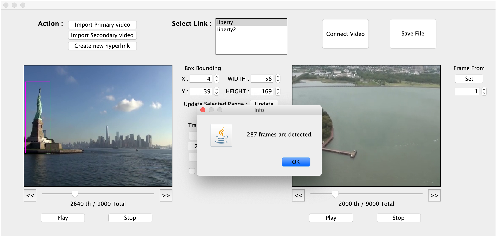
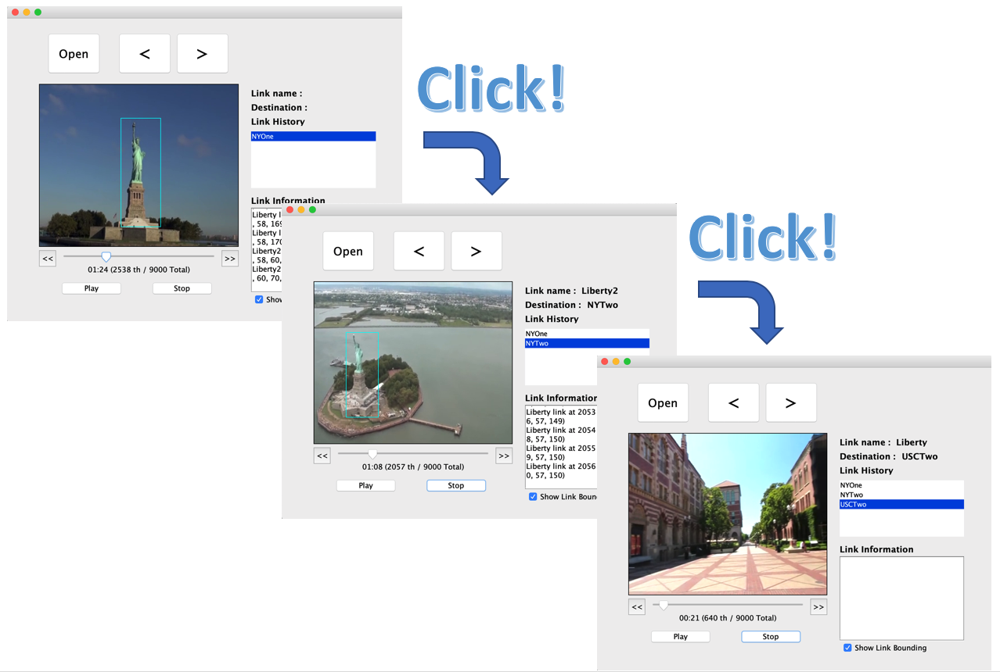

# HyperMedia

This is an implementation of [hyperlink media](https://en.wikipedia.org/wiki/Hypervideo) authoring and playing tool on Java 1.7, OpenCV (bytedeco). The User Interface is implementd with Java Swing UI. It is based on a series of images and corresponding .WAV file. Video playing parts draw each image at 30 fps. The WAV file is basically recoreded corresponding 30 fps images. Sample images and .WAV file attached in media directory.

## [authoring](https://jungbomp.github.io/HyperMedia/HyperMediaAuthor/)

The repository includes:
* Source code
* Sample Media contents
* Sample screen shots

### Datasets

The media contents consist of series of image files. Each image file is .RGB where the resolution is 352x288 containing 352x288 red bytes, followed by 352x288 green bytes, floowed by 352x288 blue bytes.

Autio Format is .WAV which is 16 bits per sample, smpling rate of 44,100 samples per second.

The tool plays link metafile which is json file containing origin of hyperlink and destination. Once link area is selected on a frame, it jumps to linked video and play.

The link of dataset
* [AlFilm](https://drive.google.com/file/d/1X7xJV0em3uiRn05Y-B5pRDPVkAx1BsgN/view?usp=sharing)
* [London](https://drive.google.com/file/d/1asHib_JR-xik9FylzS-uzvGARFbTJl7c/view?usp=sharing)
* [NewYorkCity](https://drive.google.com/file/d/1B8WbMcsKiyJFV5erhpVQDUVuAIRqp1Uk/view?usp=sharing)
* [USC](https://drive.google.com/file/d/1XjmxxeHgBIZb_uMnKP2U9k_E8ejTk9Do/view?usp=sharing)

### Demo

### Status

This is final project of CSCI-576 Multimedia System Design, 2018 fall

Version 1.0

